# ARCHITECTURE.md — System Architecture: AYURCTMS v3.0

## 1. High-Level Architectural Diagram

```mermaid
graph TD
    subgraph Client_Tier["Client Tier (React 18 / 19 SPA + PWA)"]
        UI_PI["Investigator Portal<br/>(Recruitment & Visits)"]
        UI_EC["Ethics Committee Portal<br/>(Approvals & GCP Checklists)"]
        UI_PV["NPvCC Safety Desk<br/>(MedDRA & SAE Timelines)"]
        UI_EXEC["Institutional Dashboard<br/>(GIS Map & ALCOA+ KPIs)"]
        UI_DPDP["Consent & Privacy Console<br/>(DPDP Rights & Notices)"]
    end

    subgraph API_Tier["FastAPI Modern Gateway (/api/v1)"]
        R_AUTH["RBAC & Sessions (/auth)"]
        R_ALCOA["ALCOA+ Audit Engine (/compliance/alcoa)"]
        R_INTEROP["ABDM & FHIR Gateway (/interop)"]
        R_PV["NPvCC & MedDRA Service (/pv)"]
        R_PRIVACY["DPDP Privacy Engine (/privacy)"]
        R_CDISC["CDISC Submission Exporter (/interop/cdisc)"]
        R_ESIGN["21 CFR Part 11 Signatures (/audit/esign)"]
    end

    subgraph Service_Tier["Domain Service Layer"]
        S_ALCOA["alcoa_engine.py"]
        S_ABDM["abdm_edc_service.py"]
        S_MEDDRA["meddra_service.py"]
        S_DPDP["dpdp_service.py"]
        S_CDISC["cdisc_submission_exporter.py"]
        S_ESIGN["esignature_service.py"]
        S_PVENG["pharmacovigilance_engine.py"]
    end

    subgraph Data_Tier["Persistence & Interop Tier"]
        DB_APP[("aiia_app.db / PostgreSQL<br/>ACID Relational Storage")]
        DB_AUDIT[("Cryptographic Audit Chain<br/>(SHA-256 Hash Chained Logs)")]
        EXT_ABDM["ABDM Gateway Mock<br/>(ABHA M1/M2/M3)"]
        EXT_EDC["EDC / HIS Adapters<br/>(OpenClinica, REDCap, e-Hospital)"]
        EXT_REG["Regulatory Exports<br/>(CDISC SDTM, ADaM, Define-XML, E2B R3)"]
    end

    Client_Tier -->|HTTPS REST JSON & WSS| API_Tier
    API_Tier --> Service_Tier
    Service_Tier --> Data_Tier
```

## 2. Core Subsystems

### A. ALCOA+ Data Integrity Engine
- Evaluates Attributable (authenticated user links), Legible (clean schema/data types), Contemporaneous (timestamp proximity), Original (first capture flag), Accurate (discrepancy scans), Complete (mandatory field presence), Consistent (chronological integrity), Enduring (WAL persistence), and Available (audit accessibility).
- Generates tamper-evident ALCOA+ verification certificates.

### B. ABDM Interoperability & EDC / HIS Connectors
- Implements ABDM M1 (ABHA identity generation/validation mock), M2 (Health Information Provider/User data exchange artifacts), and M3.
- Builds FHIR R4 Bundles uniting ResearchStudy, ResearchSubject, Patient, Encounter, and Condition.
- Standardized EDC ingest API accepting CSV/JSON datasets from OpenClinica and REDCap.

### C. AIIA NPvCC Pharmacovigilance Module
- 5-tier MedDRA dictionary hierarchy: System Organ Class (SOC) -> High Level Group Term (HLGT) -> High Level Term (HLT) -> Preferred Term (PT) -> Lowest Level Term (LLT).
- Automated statutory reporting deadlines: 7-day clock for fatal/life-threatening events, 14-day clock for serious events, 30-day periodic summaries.
- ICH E2B(R3) XML export generator for direct regulatory reporting.

### D. DPDP Consent & Privacy Engine
- Built according to India's Digital Personal Data Protection Act (DPDP), 2023.
- Multilingual consent notices, digital signature tokens, withdrawal mechanisms, and Data Principal rights tracker (access, rectification, erasure).
- DPO access logs.

### E. CDISC Submission-Ready Exporter
- Generation of formal SDTM datasets (TS, DM, AE, EX, DS, LB) in JSON & CSV formats.
- Generation of ADaM datasets (ADSL, ADAE) with derived endpoints.
- Define-XML 2.0 metadata generator adhering to CDISC specification.
