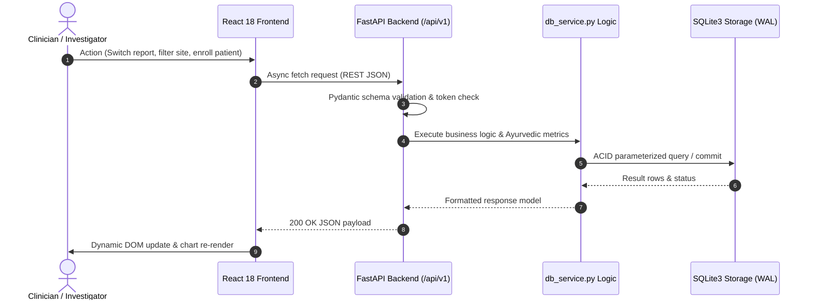

# AIIA Clinical Trial Management System (AYURCTMS)

[](https://opensource.org/licenses/MIT)
[](https://vitejs.dev/)
[](https://fastapi.tiangolo.com/)
[-green.svg)](https://www.sqlite.org/)
[](https://hl7.org/fhir/)

**AYURCTMS** is an enterprise-grade Clinical Trial Management & Real-Time Analytics Platform built for the **All India Institute of Ayurveda (AIIA)** under the **Ministry of Ayush, Government of India**. 

The platform bridges ancient Ayurvedic clinical research methodologies (Prakriti constitutional profiling, Dosha balance monitoring, Panchakarma therapy schedules) with modern international regulatory and informatics standards (**HL7 FHIR R4**, **CDISC ODM**, and **21 CFR Part 11** electronic records compliance).

---

## 📑 Architecture & Spec Documents

- **Full Architecture & Tech Stack Spec (PDF):** [AYURCTMS_Architecture_and_Tech_Stack.pdf](./AYURCTMS_Architecture_and_Tech_Stack.pdf)
- **Interactive HTML Spec:** [architecture_spec.html](./architecture_spec.html)

---

## 🏛️ System Architecture

AYURCTMS uses a high-responsiveness, 4-tier decoupled architecture designed for local-first durability and instant data synchronization:

```mermaid
graph LR
    subgraph Tier1["1. User Actors"]
        A1["Principal Investigators"]
        A2["Clinical Coordinators"]
        A3["Safety Monitors (DSMB)"]
        A4["Ayush Administrators"]
    end

    subgraph Tier2["2. Frontend Tier (React 18 + Vite)"]
        B1["State Management & Router"]
        B2["Recharts Visualizations"]
        B3["Leaflet India GIS Mapping"]
        B4["Bilingual i18n (EN / HI)"]
    end

    subgraph Tier3["3. Backend API Tier (FastAPI + Python)"]
        C1["Uvicorn Async ASGI Engine"]
        C2["Modular Route Handlers"]
        C3["Pydantic Validation Schemas"]
        C4["FHIR / CDISC Exporter"]
    end

    subgraph Tier4["4. Persistence Tier"]
        D1[("SQLite 3 with WAL Mode")]
        D2["Audit Logs & Trial DB"]
        D3["CTRI Historical Datasets"]
    end

    Tier1 -->|HTTPS UI Interaction| Tier2
    Tier2 -->|Async REST JSON| Tier3
    Tier3 -->|SQL / Transactions| Tier4
```



---

## 🔄 End-to-End Data Flow



---

## 🧰 Core Technology Stack

| Layer | Technology | Version | Purpose in AYURCTMS |
|---|---|---|---|
| **Frontend Framework** | **React** | `v18.x` | Single Page Application (SPA), state management, responsive tabs & modals |
| **Bundler & Dev Server** | **Vite** | `v5.x` | Lightning-fast HMR, optimized ESM bundling, zero-overhead production builds |
| **Backend Runtime** | **Python** | `3.10+` | Core server language for trial operations, calculations, and data processing |
| **REST API Framework** | **FastAPI** | `v0.115+` | Asynchronous non-blocking endpoints, OpenAPI/Swagger interactive docs |
| **ASGI Server** | **Uvicorn** | `v0.30+` | Production ASGI web server engine |
| **Database** | **SQLite** | `v3` (WAL) | Zero-admin, embedded relational database with ACID durability |
| **Data Visualization** | **Recharts** | `v2.x` | Responsive Prakriti breakdown, adverse event frequency, dose response |
| **Geospatial Mapping** | **Leaflet** | `v1.9+` | Interactive map of clinical trial sites across Indian states with status pins |
| **Styling & UI Kit** | **Tailwind CSS** | `v3.x` | Ayush institutional emerald/gold color scheme, accessible dark/light utility classes |
| **Icons** | **Lucide React** | Latest | Consistent, medical-grade SVG iconography |
| **Internationalization** | **react-i18next** | `v13+` | Dual-language interface supporting English and Hindi (हिन्दी) |
| **Regulatory Standards** | **FHIR / CDISC** | R4 / ODM | Standardized clinical trial export protocols for CTRI & ICMR interoperability |

---

## 🚀 Key Modules & Capabilities

1. **Live Executive Clinical Dashboard**
   - KPI metrics: Total Enrolled Patients, Active Trial Protocols, Investigational Sites, Adverse Event Indices.
   - Status indicators with zero-delay live connection standby.

2. **Ayurvedic Patient Stratification**
   - Prakriti profiling (Vata, Pitta, Kapha, and dual combinations).
   - Agni status assessment & Panchakarma therapy phase tracking.

3. **Geospatial Trial Site Network (GIS)**
   - Pan-India multi-center mapping with real-time site readiness indicators.
   - Filter by recruitment status: Active, Recruiting, Completed, or Suspended.

4. **Investigator & Doctor Cohort Profiles**
   - Direct modal profiles for Principal Investigators and Co-Investigators.
   - Associated clinical trials, active patient cohorts, qualifications, and trial compliance rates.

5. **7-Domain Regulatory Reports**
   - Instant client/server report generation across:
     - Safety & Adverse Event Reports
     - Patient Recruitment Milestones
     - Protocol Deviations & Amendments
     - Drug Accountability & Formulations
     - Site Performance & Monitoring
     - Financial Milestones
     - Regulatory Audit Logs
   - Real-time CSV and CDISC ODM data export.

---

## ⚡ Quick Start & Installation

### Prerequisites
- **Node.js**: `v18.x` or `v20.x+`
- **Python**: `3.10` or higher
- **Git**

### 1. Clone the Repository
```bash
git clone https://github.com/yogesshh-27/AIIA-Dashboard.git
cd AIIA-Dashboard
```

### 2. Backend Setup (FastAPI)
```bash
# Create and activate virtual environment (optional but recommended)
python -m venv venv
# Windows:
venv\Scripts\activate
# Linux/macOS:
source venv/bin/activate

# Install dependencies
pip install -r requirements.txt

# Start the FastAPI server (runs on http://localhost:8000)
python app_fastapi.py
```
*API documentation will be accessible at: `http://localhost:8000/docs` (Swagger UI)*

### 3. Frontend Setup (React + Vite)
```bash
# In a separate terminal, navigate to the frontend folder
cd frontend

# Install npm dependencies
npm install

# Start development server (runs on http://localhost:5173)
npm run dev
```

### 4. Running Both with Root Scripts
```bash
# Run server
npm run server

# Run frontend
npm run dev
```

---

## 📂 Repository Structure

```
AIIA-Dashboard/
├── api/                           # Modular FastAPI route controllers
│   ├── routes/
│   │   ├── audit.py               # 21 CFR Part 11 audit trails
│   │   ├── trials.py              # Trial protocol endpoints
│   │   ├── patients.py            # Patient enrollment & Prakriti
│   │   └── reports.py             # Regulatory reports endpoints
├── frontend/                      # React 18 single page application
│   ├── src/
│   │   ├── components/            # UI components (Header, Dashboard, Reports, GIS Map)
│   │   ├── locales/               # i18n translation dictionaries (en, hi)
│   │   ├── App.jsx                # Main application state & routing
│   │   └── main.jsx               # React DOM bootstrap
│   ├── package.json
│   └── vite.config.js
├── app_fastapi.py                 # FastAPI application entry point
├── db_service.py                  # Core database service layer & business logic
├── database.py                    # Database connection manager
├── models.py                      # Pydantic schemas & SQLAlchemy ORM models
├── AYURCTMS_Architecture_and_Tech_Stack.pdf # High-resolution architecture PDF
├── architecture_spec.html         # Standalone HTML architecture specification
├── requirements.txt               # Python package dependencies
└── README.md                      # Project documentation
```

---

## 🔒 Security & Regulatory Compliance

- **21 CFR Part 11:** Immutable audit logging on adverse event disclosures and patient record edits.
- **Data Protection:** Parameterized SQL queries preventing SQL injection; strict CORS origin checks.
- **Standardized Export:** Pre-configured FHIR R4 and CDISC ODM converters for external registry auditing.

---

## 📜 License & Acknowledgments

- **License:** Distributed under the [MIT License](LICENSE).
- **Institution:** Developed for the **All India Institute of Ayurveda (AIIA)**, New Delhi.
- **Sponsorship:** Ministry of Ayush, Government of India.
