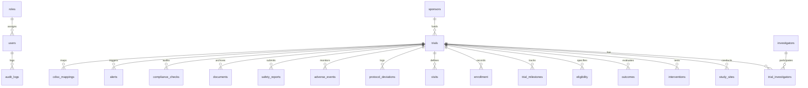

# Clinical Trials Data Foundation & Institutional Schema Documentation

## 1. Executive Architecture Overview

The **AIIA Clinical Trials Data Foundation** provides a normalized, high-performance clinical research information system supporting the **All India Institute of Ayurveda (AIIA)** and the **Clinical Trials Registry - India (CTRI)**.

The architecture strictly decouples raw historical CTRI data from the active operational application database:
- **Raw CTRI Source (`JM_CTRIdb.sqlite`)**: A 518 MB, 27-table historical dataset containing 39,821 clinical trial registrations. Kept **100% read-only and immutable**.
- **Normalized Application Database (`aiia_app.db`)**: A normalized relational database implementing 20 core clinical, operational, and governance entities.
- **Portability Engine**: Built with SQLAlchemy models supporting zero-friction dual compatibility between **SQLite** (default local execution) and **PostgreSQL** (production deployment via `DATABASE_URL`).

---

## 2. Source Database Inspection & Data Profiling

### Inspection Summary (`JM_CTRIdb.sqlite`)
The source SQLite database contains 27 flat tables extracted from CTRI registrations. Analysis confirms that none of the tables possess native SQL primary keys or foreign keys:

- **Primary Trial Identifiers**:
  - `Trial_ID` (Integer): Unique internal sequence key (39,821 distinct values).
  - `CTRI_Number` (String): Official government registry identifier (39,816 distinct values, 5 duplicate pairs).
- **Core 1:1 Tables (39,821 records each)**:
  `Study_titles`, `Study_details`, `Recruitment_details`, `Registration_details`, `Dates table`, `Primary_sponsor`, `Principal_investigator`, `Contact_person_public_query`, `Contact_person_scientific_query`, `Intervention_table`, `Method_table`, `Inclusion_criteria`, `Exclusion_criteria`, `Primary_outcomes`, `Target_sample_size`, `Study_summary`, `Publication_details`, `Source_of_Monetary_or_Material_Support`, `Countries for recruitment`, `DCGI status`, `Estimated_trial_duration`.
- **Relational 1:Many Tables**:
  - `Ethics_committee`: 81,680 records (multiple Institutional Ethics Committees per protocol).
  - `Sites_of_study`: 85,522 records (multi-centric hospital/department sites).
  - `Secondary_outcomes`: 55,894 records (multiple protocol endpoints).
  - `Secondary_id`: 41,850 records (UTRN, sponsor protocol numbers).
  - `Health_conditions`: 40,702 records.

### Data Profiling Metrics
| Field / Table | Completeness | Data Quality Findings | Normalization Strategy |
| :--- | :--- | :--- | :--- |
| `Study_titles.Public_Title` | 100.00% | Complete across all 39,821 trials | Preserved as primary public label |
| `Study_titles.Scientific_Title` | 100.00% | Complete | Preserved as formal protocol title |
| `Registration_details.Registered_on` | 100.00% | `DD/MM/YYYY` strings with leading whitespace | Normalized to ISO-8601 `YYYY-MM-DD` |
| `Recruitment_details.Recruitment_Status_India` | 98.67% | Trailing spaces, 528 blanks, 1 `character(0)` | Standardized to canonical statuses |
| `Target_sample_size.sample_size` | 100.00% | Concatenated strings: `Total Sample Size="400"...` | Parsed into clean numeric integers |
| `Primary_sponsor.primary_sponsor_name` | 99.46% | 215 missing sponsor names | Mapped to "Unspecified Sponsor" |
| `Principal_investigator.Name` | 97.36% | 1,052 missing names | Normalized and linked via `investigators` |
| `Intervention_table.Intervention_Name` | 78.92% | Missing in observational non-drug studies | Marked as observational / non-drug arm |

---

## 3. Normalized Application Database Schema (20 Entities)



### Entity Dictionary

1. **`roles`**: Access control definitions (`ADMIN`, `AUDITOR`, `INVESTIGATOR`, `COORDINATOR`) with JSON permission sets.
2. **`users`**: Institutional user accounts, password hashes, institution affiliations, and role foreign keys.
3. **`trials`**: Master protocol registry entity with normalized titles, trial type, design, phase, thesis flag, recruitment status, ISO dates, target sample size, and institutional flags (`is_aiia`, `is_ayush`).
4. **`investigators`**: Normalizes clinical researchers, designations, affiliations, contacts, and AIIA faculty status.
5. **`trial_investigators`**: Associative link table mapping investigators to trials with designated roles (Principal Investigator, Scientific Contact, Public Contact).
6. **`sponsors`**: Normalizes primary and secondary funding agencies, government bodies, and hospital institutions.
7. **`study_sites`**: Multi-centric trial sites, hospitals, and clinical trial units across India.
8. **`interventions`**: Intervention arms, dosage forms, active herbal formulations, and standard care comparators.
9. **`outcomes`**: Primary and secondary protocol endpoints with measurement timepoints.
10. **`eligibility`**: Participant inclusion/exclusion criteria, eligible age ranges, and gender specifications.
11. **`trial_milestones`**: Clinical trial lifecycle milestones (CTRI Registration, FPI, LPI, LPO, Study Completion).
12. **`enrollment`**: Site-level and trial-level target enrollment vs actual patient recruitment metrics.
13. **`visits`**: Protocol visit schedules, assessment windows, and required diagnostic evaluations.
14. **`protocol_deviations`**: Deviation tracking, severity grading (MINOR, MAJOR, CRITICAL), and corrective resolutions.
15. **`adverse_events`**: Safety vigilance tracking adverse events, causality assessments, severity, and seriousness.
16. **`safety_reports`**: Periodic DSMB reports, annual safety updates, and regulatory safety filings.
17. **`documents`**: Version-controlled clinical trial artifacts (Protocols, IEC Approvals, ICFs, CSRs).
18. **`compliance_checks`**: Institutional compliance audits (IEC clearance, prospective registration timeliness, DCGI forms).
19. **`alerts`**: System alerts for overdue study completions, retrospective registrations, and governance warnings.
20. **`audit_logs`**: Immutable audit trail recording user and system actions, entity modifications, and timestamps.
21. **`cdisc_mappings`**: CDISC Controlled Terminology repository linking NCI C-Codes, standards, terms, and CTRI fields.

---

## 4. Ingestion Process (`scripts/import_ctri.py`)

### Execution
Run the batch streaming ingestion script from the workspace root:

```bash
# Ingest full dataset with streaming batch processing (default: 500 records/batch)
python scripts/import_ctri.py --batch-size 500

# Partial ingestion for testing
python scripts/import_ctri.py --batch-size 500 --limit 1000
```

### Key Ingestion Features
- **Memory Efficiency**: Employs streaming database cursors and chunked `fetchmany()` queries, keeping RAM consumption strictly under 50 MB.
- **Duplicate Handling**: Automatically detects duplicate CTRI numbers, logs warnings with IDs, and resolves uniqueness via revision versioning (`-REV2`).
- **Date & String Sanitization**: Normalizes disparate date strings to ISO-8601 `YYYY-MM-DD` and strips whitespace / R artifacts.
- **Cohort Classification**: Automatically tags AIIA-affiliated protocols (`is_aiia = True`) and AYUSH protocols (`is_ayush = True`).
- **Audit Logging**: Automatically records an `audit_logs` entry upon completion.

---

## 5. Data Validation & Audit (`scripts/validate_data.py`)

To verify relational integrity, foreign keys, and record completeness:

```bash
python scripts/validate_data.py
```

The validation suite verifies:
- Population and schema integrity across all 20 tables.
- Foreign key constraints (verifying zero orphaned records).
- ISO-8601 date parsing accuracy.
- AIIA cohort tagging accuracy.
- Immutability of the source `JM_CTRIdb.sqlite` file.
