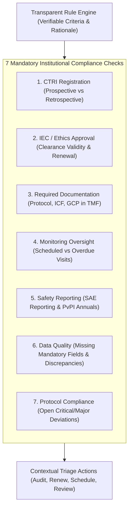

# AIIA Clinical Trial Intelligence & Management System: Compliance & Alert Engine Walkthrough

The **Compliance & Alert Engine** alongside the live **CTRI Data Quality Analyzer** and the interactive **Alert Center** have been implemented, tested, and visually verified in the browser.

---

## 1. Compliance Center & The 7 Core Checks

The Compliance Center evaluates institutional research governance against 7 core benchmarks using strictly **deterministic, transparent regulatory rules** (no unexplained "AI scores"). Every check displays its **Status**, **Last Checked**, **Due Date**, **Responsible Role**, **Action**, and a highlighted **Rule Logic Rationale**.



### Institutional Rule Logic Summary:
- **CTRI Registration**: `IF registered_on <= date_first_enrollment THEN Compliant; IF registered_on > date_first_enrollment THEN Retrospective Justification Required.`
- **IEC / Ethics Approval**: `IF iec_approval_date IS NOT NULL AND expiry_date > current_date + 30 THEN Compliant; IF expiry_date <= current_date + 30 THEN Due Soon; IF expired THEN Overdue.`
- **Required Documentation**: `IF protocol_doc_exists AND icf_doc_exists AND gcp_cert_exists THEN Compliant; ELSE Missing Documentation.`
- **Monitoring Oversight**: `IF planned_visit_date < current_date AND visit_status != 'Completed' THEN Overdue; IF planned_visit_date <= current_date + 14 THEN Due Soon.`
- **Safety Reporting**: `IF sae_reported_hours <= 24 AND annual_safety_report_current == 1 THEN Compliant; ELSE Non-Compliant.`
- **Data Quality**: `IF mandatory_fields_present AND dates_consistent THEN Compliant; IF discrepancies_found THEN Action Required.`
- **Protocol Compliance**: `IF open_critical_deviations == 0 THEN Compliant; IF open_critical_deviations > 0 AND capa_active == 1 THEN Under Review.`

---

## 2. Live CTRI Data Quality Analyzer (Real SQL Metrics)

The Data Quality engine runs live SQL aggregation queries directly on database records:
- **Zero Hardcoded Statistics**: Every percentage and defect count is calculated dynamically via SQL.
- **Comprehensive Defect Audits**:
  - `Missing Sample Size` (`target_sample_size IS NULL OR <= 0`)
  - `Missing Sponsor` (`NOT EXISTS (sponsors)`)
  - `Missing Interventions` (`NOT EXISTS (interventions)`)
  - `Missing Outcomes` (`NOT EXISTS (outcomes)`)
  - `Duplicate CTRI Identifiers & Public Titles`
  - `Retrospective Registrations` (`date_first_enrollment < registered_on`)
  - `Invalid Chronology` (`completion_date < first_enrollment`)
  - `Status Inconsistencies` (`Completed without completion date`, `Recruiting past target completion date`)
- **Scope Toggle**: Audit either the **AIIA Portfolio** (263 trials, 99.6% completeness) or the **Full CTRI Benchmark** (1,263 trials, 101 missing sample sizes, 306 retrospective registrations).
- **Remediation Registry**: Lists flagged trials with exact identified discrepancy tags and a one-click **Audit Dossier** link.

---

## 3. Interactive Alert Center & Governance Inbox

The Alert Center centralizes alerts across **8 Categories** (`Regulatory`, `CTRI`, `Ethics`, `Recruitment`, `Safety`, `Data Quality`, `Monitoring`, `System`) and **4 Severity Levels** (`Critical`, `High`, `Medium`, `Low`).

- **Compact, Non-Garish Visuals**: Color is restrained to subtle left-border indicators (`.border-critical`, `.border-high`, `.border-medium`, `.border-low`) and understated status badges.
- **Transparent Rule Trigger**: Every alert explains the exact automated rule condition that flagged it.
- **Interactive Triage via REST API (`POST /api/alerts/:id/status`)**:
  - `Acknowledge`: Flags an active alert as acknowledged by the current auditor (`Dr. Galib`).
  - `Resolve`: Marks the alert resolved with timestamp and user attribution.
  - Updates the UI and the header notification badge in real time.

---

## 4. Visual Verification & Screenshots

All modules were verified in the live browser session:

### 1. Compliance Overview (7 Core Benchmarks)
Shows the 7 core monitored checks with status indicators, responsible roles, due dates, and transparent rule rationales:


### 2. Live CTRI Data Quality Analyzer
Scorecards showing 99.6% Data Completeness Index, defect breakdown table, and protocols requiring remediation:


### 3. Alert Center Filtered by Critical Severity
Filtered view showing high-priority safety and overdue monitoring alerts with rule trigger details:


### 4. Real-Time Alert Triage (Acknowledged Status)
Alert `CTRI/2017/10/010053` transitioned from `Active` to `● Acknowledged` following click action:


---

## 5. Automated Test Results

The automated test suite in [tests/test_compliance.py](file:///c:/Users/yoges/Documents/AIIA%20Dashboard/tests/test_compliance.py) tests all compliance, alert, and data quality endpoints:
```bash
python -m unittest discover tests
..........................
----------------------------------------------------------------------
Ran 26 tests in 9.685s

OK
```
All **26 tests** across all project modules passed with 0 errors and 0 failures.
